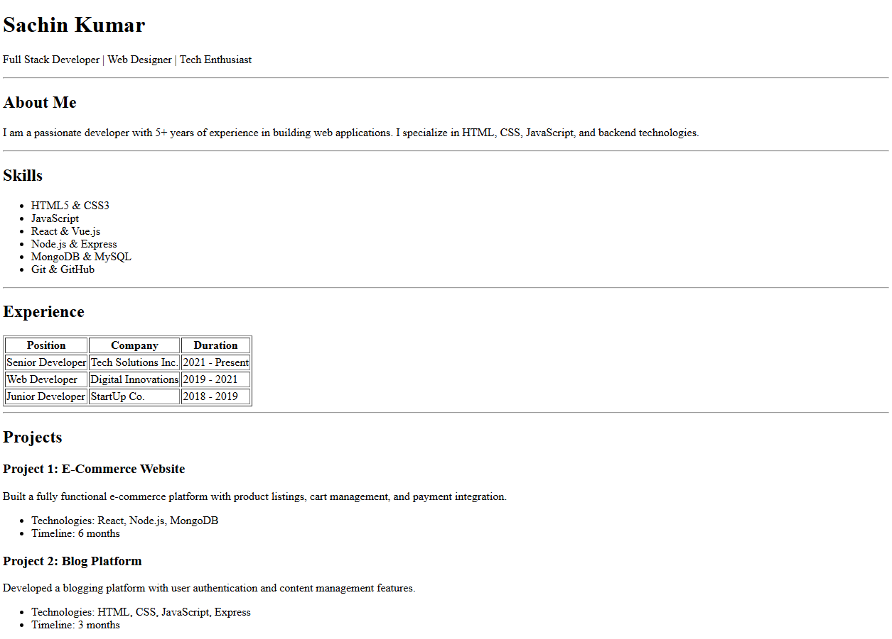
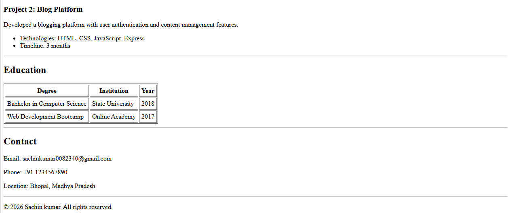

Resume Webpage (HTML Only)

This project is a simple resume webpage created using pure HTML.

It relies on basic HTML elements for structure.


Technologies Used :-
HTML5

Project Structure :-
```
├── Resume_page_assignment.html

├── README.md

└── screenshots/
    └── demo.png
```

Setup Steps :-

Follow these steps to run the project locally:

1. Clone the repository :- 
```markdown

git clone https://github.com/sxr-github/WebDev-2026.git
```

2. Open the project folder :-
```markdown
cd HTML-Resume-Page-Assignment
```

3. Open ```Resume_page_assignment```.html in any web browser:

Double-click the file

Right-click → Open with → Browser

No additional setup or dependencies are required.

Demo Screenshot :-




Live Demo :- ""

Features

a) Clean resume layout

b) Uses headings, lists, paragraphs, and tables

c) Beginner-friendly HTML

d) Suitable for academic submissions

Author :-

Sachin Kumar

Email :- sachinkumar0082340@gmail.com

